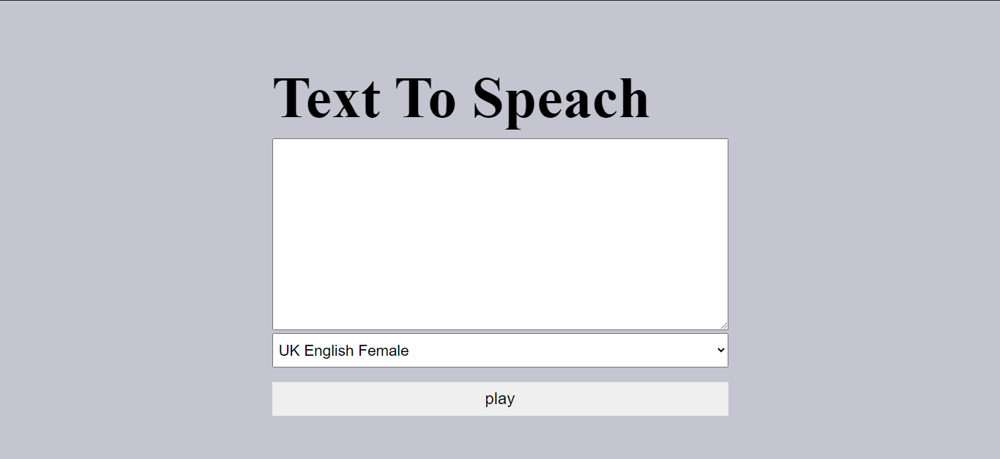

## Image 

## Documentation

<a href="https://responsivevoice.org/api/" target="_blank">
 Documentation
</a>

## Demo
<a href="https://text-to-speach.netlify.app/" target="_blank">
 Demo
</a>

## Download

1. download the project
2. use first link 
3. first login and get api and auth api
4. and enjy the project
